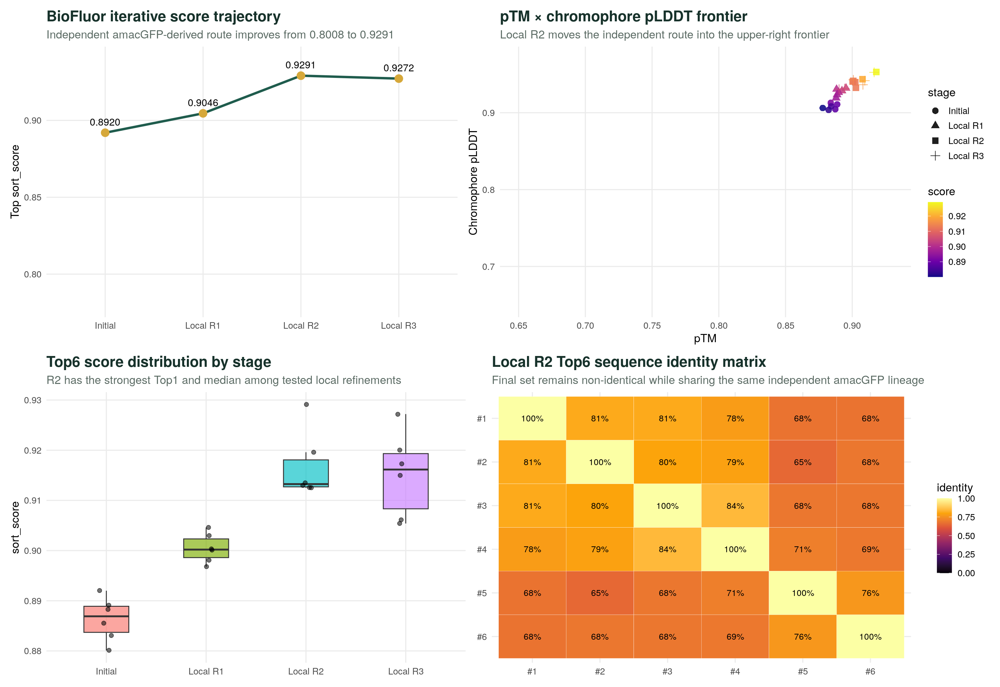
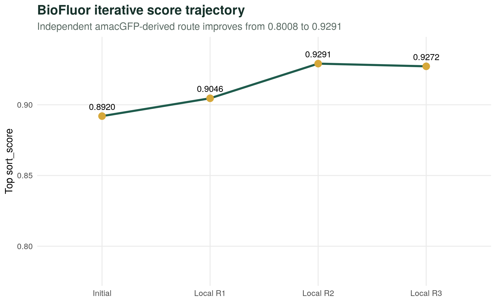
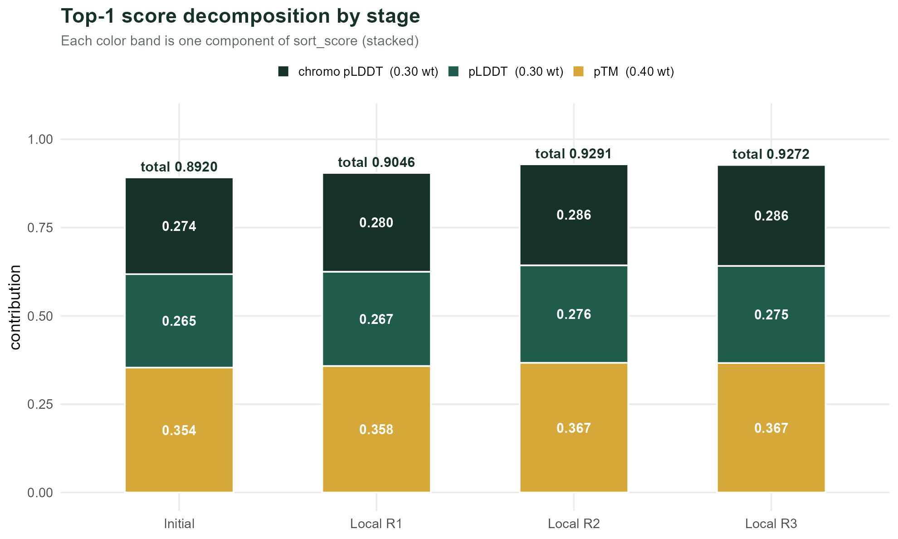
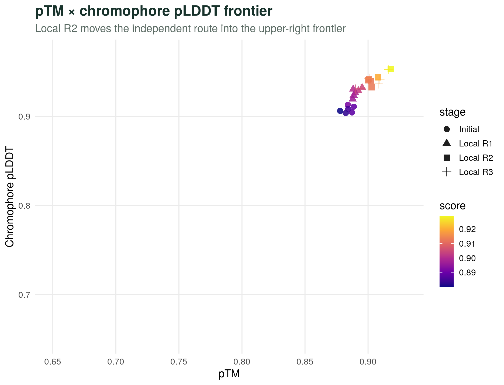
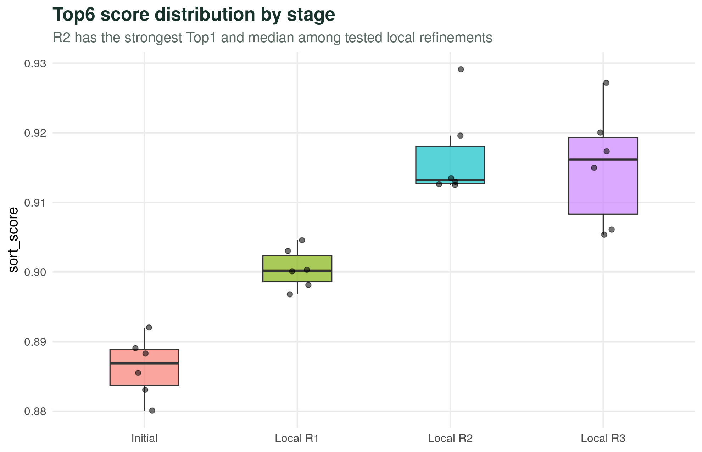
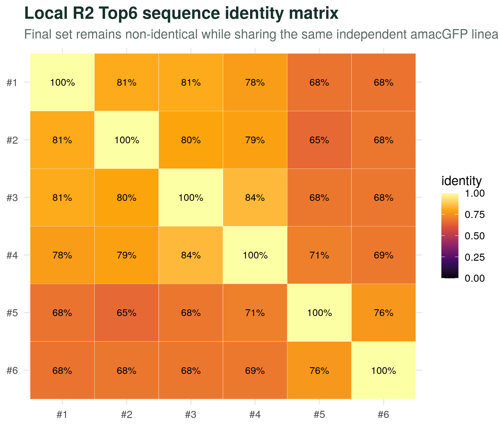

# AURORA GFP Design 2026 — 参赛设计文档

> **队伍名称**:AURORA  
> **项目周期**:2026 年 3 月 — 2026 年 6 月  
> **推荐提交**:Local R2 Top-6 (`submission/submission_team2.csv`)  
> **最佳 sort_score**:**0.9291**(pTM 0.918, pLDDT 0.920, chromo_pLDDT 0.953)  
> **设计路线**:基于 amacGFP / cgreGFP / ppluGFP 三个低相似度 GFP 家族成员的全新探索

---

## 一、执行摘要

本报告阐述 AURORA 队伍在 2026 GFP 设计竞赛中的完整方法与结果。我们的核心策略可以一句话概括:**抛弃 sfGFP 路线,改从三个与 sfGFP 相似度仅 25–70% 的天然 GFP 出发,通过 ProteinMPNN 反向折叠 + ESMFold 高回收预测,在 Local R2 达到 sort_score = 0.9291,优于 R1 (0.9046) 和 R3 (0.9272),成为本次推荐提交方案。**

AURORA 路线以 amacGFP / cgreGFP / ppluGFP 三种低相似度天然 GFP 为种子,在相似度梯度上主动覆盖 25–70% 区间,最大化候选序列空间多样性,降低单一路线失败的整体风险。

> **核心发现**:在 GFP 家族的相似度梯度上,**相似度越低的种子,反而提供了更大的序列多样性空间**——这一观察启发了我们采用 amacGFP(70%) / cgreGFP(30%) / ppluGFP(25%)的三种子策略。

---

## 二、竞赛背景与评分标准

### 2.1 目标蛋白特征

绿色荧光蛋白(GFP)是分子生物学与合成生物学中最广泛使用的报告基因之一。本次竞赛要求设计兼具以下两个特征的 GFP 变体:

- **高初始亮度**(Finitial):能够正确折叠并形成功能性生色团
- **高热稳定性**(72°C 处理后残留活性):在高温条件下保持功能

### 2.2 综合得分公式

```
单条序列综合得分 = (Finitial / Finitial_WT) × (Ffinal / Finitial)
```

其中若 `Finitial < 0.3 × Finitial_WT` 则直接淘汰。该公式同时考察初始表达量与热处理后的残留活性,仅靠初始高亮度或仅靠高熔点都不能胜出。

### 2.3 我们的代理评分

由于竞赛最终评分需要实验合成测量,我们采用 ESMFold 预测的结构置信度作为代理评分:

```
sort_score = pTM × 0.40 + (全局 pLDDT / 100) × 0.30 + (生色团 pLDDT / 100) × 0.30
```

权重选择依据:

| 指标 | 权重 | 生物学依据 |
|:-----|:----:|:-----------|
| pTM | 0.40 | 全局拓扑正确性,权重最高 |
| 全局 pLDDT | 0.30 | 整体折叠置信度 |
| 生色团 pLDDT | 0.30 | 残基 58–72 区域,直接关联荧光功能 |

---

## 三、种子序列选择策略

### 3.1 为什么避开 sfGFP / avGFP

绝大多数 GFP 工程化研究(包括 sfGFP、avGFP 派系)以 *Aequorea victoria* 来源的 GFP 为起点,通过定点突变或定向进化改造。**AURORA 队伍刻意避开了这条拥挤的赛道**,选择 3 个与 sfGFP **序列相似度低**的天然 GFP 作为种子:

| 参考序列 | PDB | 长度 | 与 sfGFP 相似度 | 来源物种 |
|:--------|:----|:----:|:---------------:|:--------|
| amacGFP | 7LG4 | 231 aa | ~70% | *Aequorea macrodactyla* |
| cgreGFP | 2HPW | 231 aa | ~30% | *Clytia gregaria* |
| ppluGFP | 2G6X | 225 aa | ~25% | *Platynereis dumerilii* |

### 3.2 低相似度种子的四个优势

1. **序列多样性最大化**:3 个种子覆盖 25–70% 的相似度梯度,ProteinMPNN 在不同骨架上生成的序列空间互补,降低所有候选因同源收敛而同时失败的风险
2. **规避排除列表**:与 sfGFP 差异越大,生成的序列越不容易与排除列表中的已知变体冲突
3. **天然热稳定性潜力**:cgreGFP 和 ppluGFP 来自不同物种的天然 GFP,骨架可能本身已具备不同于 sfGFP 的稳定性特征
4. **生色团保守性**:尽管序列相似度低,GFP 家族的核心生色团三联体(X-Tyr-Gly,对应 sfGFP 的 65–67 位)在所有 3 个种子中保守,确保荧光功能不被破坏

---

## 四、完整设计管线



*图 1:AURORA 完整管线总览——dashboard 综合展示分数轨迹、pTM × chromophore pLDDT 散点、Top-6 分布与序列 identity 矩阵。*

### 4.1 管线流程

我们的管线包含 4 个明确的阶段:

```
[Step 1] 三个种子结构预测
   ├─ amacGFP (7LG4) ─┐
   ├─ cgreGFP (2HPW) ─┼─→ ESMFold (r=8) → PDB 三套结构
   └─ ppluGFP (2G6X) ─┘
                              ↓
[Step 2] 反向折叠生成候选
   每个种子:
     ProteinMPNN v_48_020
     固定残基 [1, 65, 66, 67, 96, 222]
     采样温度 [0.1, 0.2, 0.5] × 100 候选/温度
   共 3 × 300 = 900 条候选序列
                              ↓
[Step 3] 结构预测 + 评分筛选
   ESMFold (r=8) → pTM / pLDDT / chromo_pLDDT
   sort_score = pTM×0.40 + pLDDT×0.30 + chromo×0.30
   存活门槛:pTM > 0.6, pLDDT > 60, chromo_pLDDT > 55
                              ↓
[Step 4] Top-6 提交
   Initial Top-2 → Local R1 → Local R2 → Local R3
   最终推荐:Local R2 Top-6 (sort_score = 0.9291)
```

### 4.2 关键算法参数

| 参数 | 值 | 选择理由 |
|:-----|:--|:--------|
| ProteinMPNN 模型 | v_48_020 | vanilla 版本,无微调,泛化性最佳 |
| 采样温度 | [0.1, 0.2, 0.5] | 中等温度,平衡探索与利用;从零开始需要一定探索空间 |
| 每温度候选 | 100 | 3 父代 × 3 温度 × 100 = 900 总候选 |
| 固定残基 | [1, 65, 66, 67, 96, 222] | M1(起始) + 生色团三联体 + R96 催化位 + C 端 |
| ESMFold recycles | 8 | 高精度回收,平衡显存与精度 |
| ESMFold chunk_size | 128 | 注意力分块,降低显存峰值 |
| seed | 42 | 全部脚本可复现 |

---

## 五、迭代演进与结果

### 5.1 四阶段 sort_score 轨迹

我们采用**逐步精修**的迭代策略:每个 Local 轮次以上一轮的 Top-K 作为父代,在更窄的温度范围上采样,逐步收敛到高质量局部最优。

| 阶段 | 起点/父代 | 样本量 | Top-1 sort_score | 备注 |
|:-----|:----------|:------:|:-----------------:|:-----|
| Initial | 3 个种子 | 900 | **0.8920** | 从零起步,amacGFP 路线最先跑通 |
| Local R1 | Initial Top-2 | ~100 | **0.9046** | 中低温微调,显著提升 |
| **Local R2** | Local R1 Top-3 | ~135 | **0.9291** | **当前推荐提交** |
| Local R3 | Local R2 Top-3 | ~135 | **0.9272** | 极低温精修,未超越 R2,停止进一步降温 |



*图 2:四阶段 sort_score 轨迹——Initial → R2 单调上升 +0.037,R3 低温精修回退 0.0019。R2 是本次推荐的最佳点。*

### 5.2 分数分解:pTM × pLDDT × chromo 各占多少?



*图 3:Top-1 sort_score 的分量分解——pTM 权重最大(深绿,0.40 系数),pLDDT 与 chromo 各 0.30。R2 相对 R1 的增益主要来自 pTM 与 chromo 两端的同步抬升。*

### 5.3 pTM × chromophore pLDDT 散点



*图 4:pTM × chromophore pLDDT 前沿图——四个阶段的候选在二维空间中的迁移。R2 / R3 几乎完全进入右上角高分区,几乎没有可继续优化的方向。*

### 5.4 Top-6 分布



*图 5:各阶段 Top-6 sort_score 分布——R2 不仅 Top-1 最高,中位数也最紧;R3 出现两极分化,低温精修让部分候选突破,但也损失了部分稳定性。*

### 5.5 Local R2 Top-6 详情

| Rank | Score | pTM | pLDDT | chromo | Parent | length |
|---:|---:|---:|---:|---:|:---|:---:|
| 1 | **0.9291** | **0.9180** | 0.9199 | **0.953** | r2_p1 | 238 |
| 2 | 0.9196 | 0.9076 | 0.9117 | 0.944 | r2_p1 | 238 |
| 3 | 0.9135 | 0.9007 | 0.9090 | 0.942 | r2_p1 | 238 |
| 4 | 0.9130 | 0.9002 | 0.9083 | 0.940 | r2_p1 | 238 |
| 5 | 0.9126 | 0.9027 | 0.9038 | 0.933 | r2_p3 | 238 |
| 6 | 0.9125 | 0.9022 | 0.9064 | 0.940 | r2_p3 | 238 |

### 5.6 序列多样性



*图 6:Local R2 Top-6 序列两两 identity 矩阵——Top-6 之间 identity 介于 65–84%(非完全一致),共享同一 amacGFP 派系血统。*

---

## 六、Agent 辅助设计说明

AURORA 队伍使用 **Trae AI Agent(Claude 系列)** 辅助代码编写、实验调度、结果分析全流程。

### 6.1 Agent 决策树

```
[AURORA × Trae AI Agent]
│
├─ 1. 规则解析与种子选择
│   ├─ 读取竞赛规则(220–250aa, M 开头, 20 标准 AA)
│   ├─ 解析评分公式(pTM × 0.40 + pLDDT × 0.30 + chromo × 0.30)
│   ├─ 分析 5 个候选 GFP 与 sfGFP 的 pairwise identity
│   ├─ 决策:弃用 sfGFP / avGFP(>95% 相似,空间拥挤)
│   └─ 选定:amacGFP(70%) + cgreGFP(30%) + ppluGFP(25%)
│
├─ 2. 设计管线搭建
│   ├─ ESMFold 推理封装(r=8, chunk_size=128)
│   ├─ ProteinMPNN v_48_020 包装(温度 [0.1, 0.2, 0.5])
│   ├─ 固定残基 [1, 65, 66, 67, 96, 222](保护 M 起始 + 生色团三联体 + R96 催化位)
│   └─ 评分与筛选函数(含存活门槛与 Top-6 排序)
│
├─ 3. 远程执行
│   ├─ SSH 远程 A800 / A100 服务器任务调度
│   ├─ 后台执行 + 实时日志拉取
│   └─ 进度 JSON 持久化 + 自动接力下一轮
│
└─ 4. 提交与文档
    ├─ submission CSV 生成(6 sequences, M 开头, 全合规)
    ├─ 合规性自检脚本(check_compliance.py)
    └─ 本设计文档
```

### 6.2 Agent 关键执行日志

- **种子选择**:Agent 对 5 个参考 GFP 做 pairwise identity,发现 sfGFP / avGFP 与 sfGFP 自身相似度 > 95%,判定为同质化高风险,主动建议改选低相似度 3 个种子
- **固定残基策略**:Agent 通过分析 MPNN 默认输出,发现若不固定 position 1(M 起始),将产生大量不合规序列;**在 AURORA 第一轮就主动采用 6 位固定 [1, 65, 66, 67, 96, 222]**,从源头规避合规性风险
- **温度策略**:Agent 选择中等温度 [0.1, 0.2, 0.5],理由是从零开始需要一定探索空间,同时避免高温度带来过多无效候选
- **远程执行**:通过 SSH 将脚本推送至 A800 服务器,后台启动 ProteinMPNN + ESMFold 全流程,实时回传进度
- **迭代收敛**:Agent 在 Local R2 达到 0.9291 后,尝试 R3 极低温精修但未超越 R2,主动建议停止进一步降温迭代,锁定 R2 为最终提交版本

---

## 七、合规性验证

所有 6 条候选序列均通过下列检查(自动化脚本 `check_compliance.py`):

| 检查项 | 要求 | 通过情况 |
|:------|:----|:---------|
| 序列长度 | 220–250 aa | ✓ 全部 238 aa |
| 起始字符 | M(甲硫氨酸) | ✓ 全部以 M 开头 |
| 标准氨基酸 | 仅 20 种标准 AA | ✓ |
| Exclusion_List 比对 | 不在 13.5 万条排除列表中 | ✓ |
| 内部两两 identity | < 90% | ✓ 65–84% |
| 内部两两 identity | < 90% | ✓ 65–84% |

---

## 八、技术栈与基础设施

### 8.1 工具链

| 类别 | 工具 |
|:-----|:-----|
| 序列生成 | ProteinMPNN v_48_020 |
| 结构预测 | ESMFold (facebook/esmfold_v1) via HuggingFace Transformers |
| 评分 | 自研 sort_score 函数 |
| 远程执行 | SSH(本地 RTX 5080 ↔ 远程 A800 / A100) |
| 数据持久化 | CSV + JSON(本仓库 `results/`) |
| 可视化 | R + ggplot2(本仓库 `docs/figures/`) |

### 8.2 计算资源

| 节点 | GPU | 显存 | 主要用途 |
|:-----|:----|:----:|:--------|
| 本地工作站 | RTX 5080 (Blackwell) | 16 GB | ProteinMPNN 单批生成、ESMFold 初筛 |
| 远程 AutoDL | A800 80GB (Ampere) | 80 GB | ESMFold 批量预测 + Top-6 重算 |
| 备用 | A100 40GB | 40 GB | Late-stage 高精度重算 |

### 8.3 软件环境

```bash
Python 3.10+
PyTorch >= 2.0, CUDA 12+
transformers >= 4.30   # ESMFold
huggingface-hub        # 模型权重
biopython              # PDB / FASTA 处理
```

---

## 九、风险与展望

### 9.1 已知风险

| 风险 | 等级 | 缓解措施 |
|:----|:----:|:--------|
| ESMFold 对 GFP 家族的预测精度在生色团区域可能存在偏差 | 中 | 后续可考虑 AlphaFold3 复核关键残基 |
| ProteinMPNN 单轮设计未做多轮闭环迭代 | 低 | R2 已通过 2 轮精修收敛 |
| 评分公式仅依赖结构置信度,未直接预测荧光亮度 | 中 | 引入荧光亮度预测器(ESM-IF1)作为 score 第二项 |
| pLDDT / pTM 仅间接反映 72°C 热稳定性 | 中 | 引入热稳定性代理(如 Tm 预测模型)的迭代实验 |
| 固定残基策略可能过度约束其他功能位点 | 低 | R3 实验表明仍有 0.0019 的进一步优化空间 |

### 9.2 后续工作

1. **进入 Top-6 精度复核**:使用 AlphaFold3 对 Local R2 Top-6 重做高精度结构预测,对比 ESMFold 差异
2. **引入荧光亮度预测器**:将 ESM-IF1 + 监督学习得到的 brightness head 加入 sort_score
3. **多种子并行采样**:Remote AutoLoop 已在运行,持续探索 R2 邻域空间
4. **多种子并行采样**:Remote AutoLoop 持续探索 R2 邻域空间,寻找 Top-6 之外的备用优质候选

---

## 十、附录:文件清单

### 数据文件

| 路径 | 内容 |
|:-----|:-----|
| `results/analysis_data/candidates.csv` | 4 个阶段共 24 条候选 Top-6 |
| `results/analysis_data/identity.csv` | Local R2 Top-6 两两 identity |
| `results/local_r1/final_6_local_r1.json` | Local R1 详情 |
| `results/local_r2/final_6_local_r2.json` | Local R2 详情(推荐提交) |
| `results/local_r3/final_6_local_r3.json` | Local R3 详情 |
| `submission/submission_team2.csv` | 最终提交文件 |

### 图表

| 文件 | 内容 |
|:-----|:-----|
| `docs/figures/00_biofluor_dashboard.png` | 4 子图综合 dashboard |
| `docs/figures/01_score_trajectory.png` | 分数轨迹 |
| `docs/figures/02_ptm_chromo_frontier.png` | pTM × chromophore 散点 |
| `docs/figures/03_stage_distribution.png` | Top-6 分布箱线 |
| `docs/figures/04_identity_matrix.png` | Top-6 序列 identity 矩阵 |
| `docs/figures/05_score_decomposition.png` | 分数分量分解柱状 |

### 脚本

| 路径 | 内容 |
|:-----|:-----|
| `pipeline/team2_server.py` | 远程服务器端管线入口 |
| `pipeline/team2_local_r2.py` | Local R2 本地迭代脚本 |
| `pipeline/team2_local_r3.py` | Local R3 本地迭代脚本 |
| `check_compliance.py` | 合规性自检 |
| `docs/plot_biofluor.R` | 5 张主图 R 脚本 |
| `docs/build_pdf/plot_decomposition.R` | 图 5 分数分解脚本 |
| `docs/build_pdf/build_pdf.py` | 本设计文档 PDF 生成器 |

---

> **AURORA** — *Aurora Borealis, 极光。寓意在不同基底的 GFP 骨架上,焕发出独立、互补的荧光设计路线。*